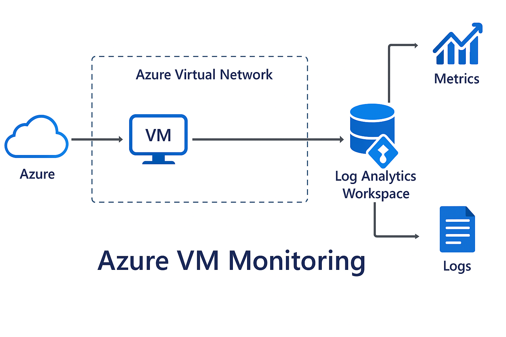

# Azure VM Monitoring

[](https://developer.hashicorp.com/terraform)
[](https://azure.microsoft.com/)
[](https://learn.microsoft.com/en-us/azure/azure-monitor/)
[](LICENSE)

---

## Overview

This project provisions a monitored Linux Virtual Machine in Microsoft Azure using Terraform. It configures full-stack monitoring via Log Analytics Workspace and sets up alerting with an action group that sends an email on high CPU usage.

---

## Architecture



---

## Components

- **Azure Linux VM** (Ubuntu 20.04 LTS)
- **Virtual Network and Subnet**
- **Network Interface + Public IP**
- **Log Analytics Workspace**
- **Boot Diagnostics**
- **Azure Monitor + Alerts**
- **Email Action Group**

---

## Folder Structure

```
azure-vm-monitoring/
├── .gitignore
├── LICENSE
├── README.md
└── terraform/
    ├── assets/
    │   └── azure-diagram.png
    ├── user-data/
    │   └── cloud-init.yaml
    ├── main.tf
    ├── monitoring.tf
    ├── network.tf
    ├── outputs.tf
    ├── provider.tf
    ├── random.tf
    ├── storage.tf
    ├── variables.tf
    ├── versions.tf
    └── vm.tf
```

---

## Setup Instructions

1. **Clone the repo**
   ```bash
   git clone https://github.com/roberto-a-cardenas/azure-vm-monitoring.git
   cd azure-vm-monitoring/terraform
   ```

2. **Initialize Terraform**
   ```bash
   terraform init
   ```

3. **Preview and apply changes**
   ```bash
   terraform plan
   terraform apply
   ```

---

## Monitoring Details

- **Azure Monitor** tracks CPU utilization.
- **Log Analytics Workspace** collects logs and metrics.
- **Email alerts** are triggered when CPU > 70% for 5 minutes.

---

## License

This project is licensed under the [MIT License](./LICENSE).

## Author

**Roberto-A-Cardenas** — [GitHub](https://github.com/Roberto-A-Cardenas)

